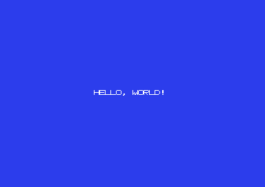

# Hello World GRAFICO in Assembly per Commodore 64

Versione **grafica** del classico "hello world" per C64: la scritta
`HELLO, WORLD!` **non** viene stampata come testo, ma **disegnata pixel
per pixel** in un bitmap hires 320x200 tramite il VIC-II.

- CPU: MOS 6510
- Video: standard bitmap mode (hires), 320x200, 2 colori per cella
- Assembler: [ACME](https://sourceforge.net/projects/acme-crossass/)
- Emulatore: [VICE](https://vice-emu.sourceforge.io/) (`x64sc`)



> Lo `screenshot.png` si genera con `make screenshot`.

## Differenza rispetto alla versione testo

| | `c64-helloworld` (testo) | `c64-helloworld-graphic` (grafica) |
|---|---|---|
| Modalità video | text mode (default) | bitmap hires 320x200 |
| Output | caratteri nella video-RAM | pixel nel bitmap `$2000-$3FFF` |
| Stampa | routine KERNAL `CHROUT` (`$FFD2`) | copia di un font 8x8 nel bitmap |
| Colori | color RAM `$D800` | video matrix `$0400` (nibble alto/basso) |

## File

| File | Descrizione |
|------|-------------|
| `graphic.asm` | Sorgente assembly (ACME) |
| `Makefile` | Compilazione, esecuzione e screenshot |
| `README.md` | Questo file |
| `graphic.prg` | Eseguibile C64 generato (non versionato) |

## Compilare ed eseguire

```sh
make             # assembla graphic.asm -> graphic.prg
make run         # avvia in VICE (x64sc)
make screenshot  # esegue e salva screenshot.png
make clean       # rimuove i file generati
```

Requisiti su Arch/CachyOS:

```sh
sudo pacman -S acme vice
```

---

## Come funziona

### 1. BASIC stub

Come nella versione testo, il PRG inizia a `$0801` con la riga BASIC
`10 SYS 2061`, che salta al codice macchina a `$080D`.

### 2. Configurazione del VIC-II per la bitmap mode

| Registro | Valore | Significato |
|----------|--------|-------------|
| `$D011` | `$3B` | `BMM=1` (bitmap), `DEN=1`, `RSEL=1` (25 righe), yscroll 3 |
| `$D016` | `$08` | `MCM=0` (hires), `CSEL=1` (40 colonne), xscroll 0 |
| `$D018` | `$18` | video matrix a `$0400`, bitmap a `$2000` |
| `$D020` | `$06` | colore bordo (blu) |
| `$D021` | `$06` | colore sfondo (non usato in hires bitmap) |

### 3. Layout della memoria bitmap

Il bitmap occupa **8000 byte** (`$2000-$3F3F`), organizzato in 1000 celle
8x8 nell'ordine della video matrix. Gli 8 byte di una cella sono
**contigui**:

```
indirizzo(cella riga R, col C, pixel row p) =
        $2000 + R*320 + C*8 + p
```

Quindi ogni pixel si indirizza con:

```
addr = $2000 + (y/8)*320 + (x/8)*8 + (y%8)
bit  = 7 - (x%8)
```

### 4. Colori in bitmap mode

Non si usa la color RAM: per ogni cella 8x8 il byte della video matrix
seleziona due colori:

- **nibble alto** = colore dei pixel a `1`
- **nibble basso** = colore dei pixel a `0`

Abbiamo riempito la video matrix con `$16` = bianco (1) su blu (6), e
azzerato il bitmap: risultato bianco su blu.

### 5. Il testo è disegnato, non stampato

Il programma:

1. azzera il bitmap (`$2000-$3FFF`);
2. riempie la video matrix con `$16`;
3. per ogni glifo del messaggio copia 8 byte dal font al bitmap
   (`draw_glyph`);
4. abilita la bitmap mode (`$D011`).

Il font è una tabella 8x8 scritta a mano nel sorgente (`glyph_H`,
`glyph_E`, ...). La tabella `message` contiene i **puntatori** ai glifi,
terminata da una word `$0000`.

Il programma poi resta in un loop (`sei` + `jmp`) per mantenere l'immagine
stabile, dato che in modalità grafica la schermata BASIC non è più
significativa.

## Sintassi ACME usata

| Direttiva | Significato |
|-----------|-------------|
| `!cpu 6510` | set di istruzioni |
| `!to "graphic.prg", cbm` | output PRG con load address |
| `* = $0801` | contatore di programma |
| `!byte`, `!word` | dati a 8 / 16 bit |
| `simbolo = valore` | costanti (usate per la zero page) |

## Verifica

Con `make screenshot` si ottiene la schermata dell'emulatore, utile per
controllare il risultato senza aprire la finestra di VICE.
